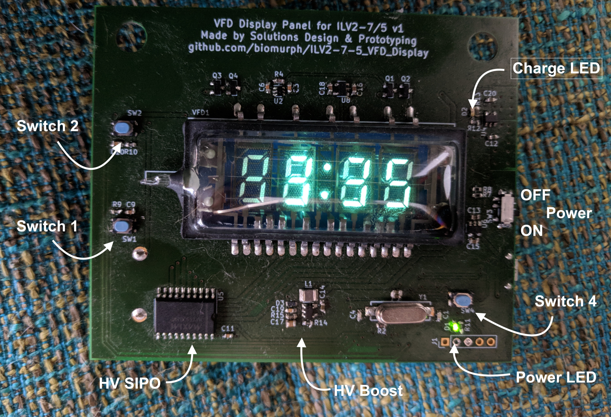

# ILV2-7-5_VFD_Display
KiCAD circuit for a VFD Clock using the Popular ILV2-7/5 flat tube segmented nixie tube thingie

Not sure if [this link](https://www.ebay.com/itm/Lot-of-20-IVL2-7-5-IVL-VFD-DIGIT-CLOCK-DISPLAY-TUBE-GREEN-Tube-New-FREE-SHIPPING/252890205246?_trkparms=aid%3D222007%26algo%3DSIM.MBE%26ao%3D2%26asc%3D41375%26meid%3Dbe2e339f0da54301a07820f89799816e%26pid%3D100623%26rk%3D3%26rkt%3D6%26sd%3D192058830857&_trksid=p2047675.c100623.m-1) still works

This work is greatly indebted to work that came before. Namely
[Callum Nunez-Vas](https://callumnunesvaz.wordpress.com/) and his [Dogbone Watch](https://callumnunesvaz.wordpress.com/portfolio/dogbonevfd/) which is also based on the [cyberpunk wristwatch](http://www.johngineer.com/blog/?p=1595) by [johngineer](http://www.johngineer.com/blog/).

I made some changes.

First, my uC is a [PIC32MX250F128B](http://www.microchip.com/wwwproducts/en/PIC32MX250F128B), which supports USB OTG, which is nice and it's also Arduino compatible via ChipKIT and Digilent's [DP32](http://chipkit.net/wiki/index.php?title=ChipKIT_DP32) which makes it nice for sharing.

The other thing that I changed is the oscillator that Callum used to drive the Cathode filament. Callum drives it with a timer on his PIC16F828. I needed more pins, so I decided to make a stand-alone relaxation oscillator built out of a [74HCG214](https://www.mouser.com/ProductDetail/Nexperia/74HC2G14GV125/?qs=sGAEpiMZZMutVWjHE%2fYQwzJv2zzn7Nf7cpkcMgkB%2fH8%3d) dual Schmidtt Trigger Inverter. I set mine up as a dual oscillator clocking at ~1KHz to drive the hours/mimutes Cathodes. 

There's two pushbuttons for interfacing and an LED for control and user feedback. I'm using the same [DS3231](https://www.maximintegrated.com/en/products/digital/real-time-clocks/DS3231.html) that Callum uses, and also the [MAX6920](https://www.maximintegrated.com/en/products/power/display-power-control/MAX6920.html) for the high voltage SIPO to drive the segments.

It's pretty basic beyond that. The power supply is based on the Dogbone, and I have a V-divider set up as a battery level sensor that the PIC can read. 

# Push Button Control

## Test Battery Level
Press Switch 2 once. The screen will print a lowercase `b` and then the voltage level with 0.01mV resolution. Press again to go back to time display.

## Change Time
Press Switch 1 once. Hour will blink. Press Switch 2 to increment hour.

Press Switch 1 again. Minute will blink. Press Switch 2 to increment minute.

Press Switch 1 again. Display will show option between 24 hour and 12 hour time. Press Switch 2 to toggle between 24h and 12h.

Press Switch 1 again to go back to the time display.

# Power & Charging

The thing runs on a high capacity LiPo battery. Plug it into a micro USB cable for charging. You can also program the PIC through the USB connection if you want to.

